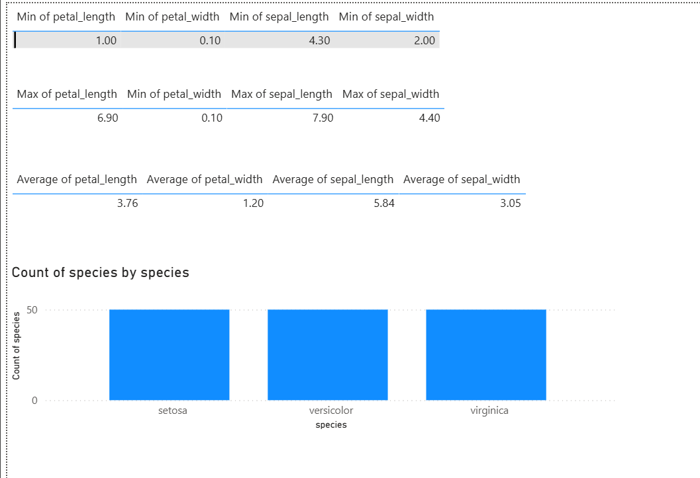

# Power BI Eksplorasi Data Iris

## 1. Nilai Minimum (Min) tiap Kolom
- Petal Length: 1.00  
- Petal Width: 0.10  
- Sepal Length: 4.30  
- Sepal Width: 2.00  

Menunjukkan ukuran terkecil dari kelopak dan sepal pada dataset.

---

## 2. Nilai Maksimum (Max) tiap Kolom
- Petal Length: 6.90  
- Petal Width: 2.50  
- Sepal Length: 7.90  
- Sepal Width: 4.40  

Menunjukkan ukuran terbesar dari kelopak dan sepal.

---

## 3. Nilai Rata-rata (Average) tiap Kolom
- Petal Length: 3.76  
- Petal Width: 1.20  
- Sepal Length: 5.84  
- Sepal Width: 3.05  

Memberikan gambaran ukuran tipikal bunga Iris.

---

## 4. Jumlah Data pada Setiap Kelas (Species)
Ditampilkan dalam grafik batang pada Power BI:

- Setosa: 50 sampel  
- Versicolor: 50 sampel  
- Virginica: 50 sampel  

Distribusi data antar kelas seimbang (balanced), sehingga baik untuk analisis dan machine learning karena tidak ada kelas yang dominan.

---

## Kesimpulan
Dari eksplorasi data ini dapat disimpulkan bahwa:  
1. Ukuran sepal lebih besar dibandingkan petal.  
2. Rentang data bervariasi (petal length memiliki variasi paling besar).  
3. Jumlah data tiap kelas seimbang (50 sampel per kelas).  
